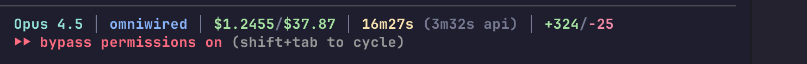

# claude-statusline

A lightweight, memory-efficient status line for [Claude Code](https://claude.ai/code).



## Features

Displays real-time session information in your Claude Code status bar:

- **Model** - Current Claude model (Opus, Sonnet, etc.)
- **Directory** - Current working directory with git branch
- **Cost** - Session cost (and daily total if configured)
- **Duration** - Total session time and API time
- **Lines changed** - Lines added/removed in the session

Example output:
```
Opus │ myproject@main │ $0.1234/$4.56 │ 5m23s (2m10s api) │ +156/-23
```

## Why claude-statusline?

Claude Code's [official documentation](https://docs.anthropic.com/en/docs/claude-code) suggests using `ccusage statusline` directly:

```json
{
  "statusLine": {
    "type": "command",
    "command": "npx ccusage statusline"
  }
}
```

**The problem:** This spawns a full Node.js process via npx/bun on every status update (every ~300ms), consuming **~1GB of RAM** continuously.

**Our solution:** Pure bash + `jq` for the status line (~0MB overhead), with an optional cached daily cost script that only refreshes hourly in the background. You get the same information without the memory bloat.

## Requirements

- [Claude Code](https://claude.ai/code) CLI
- `jq` - JSON processor ([install](https://jqlang.github.io/jq/download/))
- `git` (optional, for branch display)

## Installation

### Quick Install

```bash
# Download the script
curl -o ~/.claude/statusline.sh https://raw.githubusercontent.com/omniwired/claude-statusline/main/statusline.sh

# Make it executable
chmod +x ~/.claude/statusline.sh
```

### Manual Install

1. Copy `statusline.sh` to `~/.claude/statusline.sh`
2. Make it executable: `chmod +x ~/.claude/statusline.sh`

### Configure Claude Code

Add to your `~/.claude/settings.json`:

```json
{
  "statusLine": {
    "type": "command",
    "command": "~/.claude/statusline.sh"
  }
}
```

Restart Claude Code to see the status line.

## Available Data

The script has access to all data provided by Claude Code's status hook:

| Field | Description |
|-------|-------------|
| `model.display_name` | Model name (Opus, Sonnet) |
| `model.id` | Full model ID |
| `cost.total_cost_usd` | Session cost in USD |
| `cost.total_duration_ms` | Total session duration |
| `cost.total_api_duration_ms` | Time spent on API calls |
| `cost.total_lines_added` | Lines of code added |
| `cost.total_lines_removed` | Lines of code removed |
| `workspace.current_dir` | Current working directory |
| `workspace.project_dir` | Original project directory |
| `session_id` | Session identifier |
| `transcript_path` | Path to transcript file |
| `version` | Claude Code version |

## Daily Cost Tracking (Optional)

To show daily total cost alongside session cost, set up the included cache script:

### 1. Install the cache script

```bash
# Download and install
curl -o ~/.local/bin/ccusage-cached https://raw.githubusercontent.com/omniwired/claude-statusline/main/ccusage-cached.sh
chmod +x ~/.local/bin/ccusage-cached
```

This script fetches daily costs via [ccusage](https://github.com/ryoppippi/ccusage) and caches results for 1 hour to avoid heavy npm/bun calls.

### 2. Trigger cache updates

Add to your shell prompt (e.g., starship custom command, oh-my-zsh) or run periodically:

```bash
~/.local/bin/ccusage-cached > /dev/null
```

**Starship example** (add to `~/.config/starship.toml`):

```toml
[custom.ccusage]
command = "~/.local/bin/ccusage-cached"
when = "test -f ~/.cache/ccusage_status"
format = '[$output]($style) '
style = "green"
```

The status line will automatically pick up the daily total from `~/.cache/ccusage_status`.

## Customization

The script uses ANSI colors that work in most terminals. Edit `statusline.sh` to customize:

- **Colors** - Modify the color variables at the top
- **Layout** - Rearrange or remove sections in the output building section
- **Data** - Add more fields from the available data

### Color Reference

```bash
RESET=$'\033[0m'
BOLD=$'\033[1m'
DIM=$'\033[2m'
CYAN=$'\033[36m'
YELLOW=$'\033[33m'
GREEN=$'\033[32m'
MAGENTA=$'\033[35m'
BLUE=$'\033[34m'
RED=$'\033[31m'
```

## Troubleshooting

### Status line not showing

1. Check Claude Code settings: `cat ~/.claude/settings.json`
2. Verify script is executable: `ls -la ~/.claude/statusline.sh`
3. Test script manually: `echo '{"model":{"display_name":"Test"}}' | ~/.claude/statusline.sh`

### Colors not working

Ensure your terminal supports ANSI colors. The script uses `$'...'` syntax for proper escape sequence handling in bash.

### jq not found

Install jq:
- macOS: `brew install jq`
- Ubuntu/Debian: `apt install jq`
- Other: https://jqlang.github.io/jq/download/

## License

MIT License - see [LICENSE](LICENSE) for details.

## Contributing

Contributions welcome! Feel free to open issues or submit pull requests.
